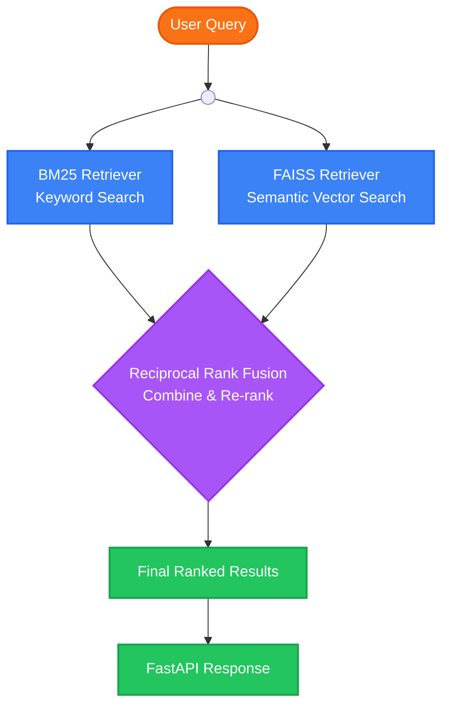
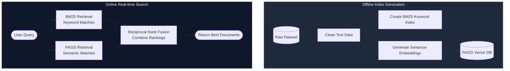

# 🚀 Hybrid Search Engine
### AI-Powered Semantic + Keyword Search using BM25, FAISS & Sentence Transformers


A production-style **Hybrid Search Engine** that combines **traditional keyword search (BM25)** with **semantic vector search (FAISS + Sentence Transformers)** to deliver highly relevant search results.

Unlike a traditional search engine that only matches keywords, this project understands the **meaning behind a query**, making it suitable for AI-powered document retrieval and Retrieval-Augmented Generation (RAG) applications.

---

# ✨ Features

- 🔍 Keyword Search using BM25
- 🧠 Semantic Search using Sentence Transformers
- ⚡ Fast Vector Search using FAISS
- 🔀 Hybrid Search using Reciprocal Rank Fusion (RRF)
- 🚀 REST API built with FastAPI
- 📂 Offline Index Generation Pipeline
- 📊 Supports thousands of documents efficiently
- 📦 Clean, modular, production-ready architecture

---

# 🏗️ Architecture



---

# 📂 Project Structure

```
hybrid_search_project/
│
├── api/
│   └── main.py
│
├── dataset/
│   └── datasets.csv
│
├── indexes/
│   ├── bm25_index.pkl
│   ├── documents.pkl
│   └── vector_index.faiss
│
├── ingestion/
│   ├── __init__.py
│   └── ingest.py
│
├── retrieval/
│   ├── __init__.py
│   ├── bm25_retriever.py
│   ├── faiss_retriever.py
│   └── hybrid_retriever.py
│
├── test/
│   ├── test_bm25.py
│   ├── test_faiss.py
│   └── test_hybrid.py
│
├── utils/
│   ├── __init__.py
│   └── config.py
│
├── app.py
├── requirements.txt
└── README.md
```

---

# 🛠️ Tech Stack

| Technology | Purpose |
|------------|---------|
| Python | Programming Language |
| FastAPI | REST API |
| FAISS | Vector Similarity Search |
| Sentence Transformers | Text Embeddings |
| BM25 | Keyword Retrieval |
| Pandas | Data Processing |
| NumPy | Numerical Computation |
| Pickle | Saving Indexes |

---

# ⚙️ Installation

Clone the repository

```bash
git clone https://github.com/yourusername/hybrid_search_project.git
```

Move inside the project

```bash
cd hybrid_search_project
```

Create virtual environment

```bash
python -m venv venv
```

Activate it

### Mac/Linux

```bash
source venv/bin/activate
```

### Windows

```bash
venv\Scripts\activate
```

Install dependencies

```bash
pip install -r requirements.txt
```

---

# 📥 Build Search Indexes

Run the ingestion pipeline

```bash
python -m ingestion.ingest
```

This generates:

```
documents.pkl
bm25_index.pkl
vector_index.faiss
```

inside the **indexes/** folder.

---

# 🚀 Run the API

```bash
uvicorn api.main:app --reload
```

Server starts at

```
http://127.0.0.1:8000
```

Swagger Documentation

```
http://127.0.0.1:8000/docs
```

---

# 🔍 API Endpoints

## Home

```
GET /
```

Response

```json
{
    "message":"Hybrid Search Engine API is Running!"
}
```

---

## Search

```
GET /search
```

Example

```
http://127.0.0.1:8000/search?query=stock market
```

Example Response

```json
[
  {
    "rank":1,
    "document_id":1457,
    "rrf_score":0.0325,
    "description":"Irish markets reach all-time high...",
    "tags":"business, economy, finance"
  }
]
```

---

# 🧠 How It Works



### Step-by-Step

1. **Load dataset**
2. **Clean the text**
3. **Create BM25 keyword index**
4. **Generate Sentence Embeddings**
5. **Store vectors inside FAISS**
6. **User sends a query**
7. **BM25 retrieves keyword matches**
8. **FAISS retrieves semantic matches**
9. **Reciprocal Rank Fusion combines both rankings**
10. **Return the best documents**

---

# 📈 Future Improvements

- GPT-powered answer generation
- RAG chatbot
- Cross Encoder reranking
- Query expansion
- Multi-language search
- Streamlit UI
- Docker support
- Cloud deployment
- Elasticsearch integration
- User authentication

---

# 📊 Example Queries

```
stock market
football world cup
machine learning
covid vaccine
apple iphone
space exploration
climate change
artificial intelligence
financial crisis
bbc sports
```

---

# 🎯 Use Cases

- Document Search
- AI Chatbots
- Retrieval-Augmented Generation (RAG)
- Enterprise Knowledge Base
- News Search Engine
- Research Assistant
- Legal Document Search
- Healthcare Information Retrieval

---

# 📌 Key Concepts Used

- Information Retrieval
- Semantic Search
- Dense Vector Embeddings
- BM25 Ranking
- FAISS Vector Database
- Reciprocal Rank Fusion (RRF)
- REST APIs
- FastAPI
- Vector Similarity Search

---

# 👩💻 Author

**Anshika Srivastava**

Machine Learning & Data Science Enthusiast

GitHub:
https://github.com/Anshika66

---

# ⭐ If you found this project useful

Give this repository a ⭐ on GitHub!


